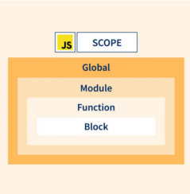
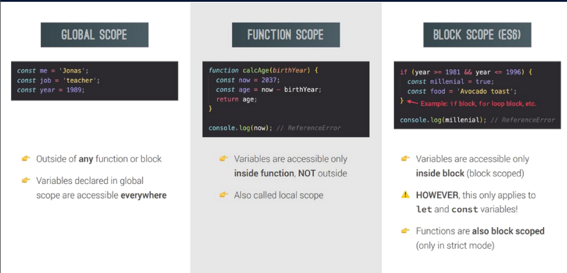
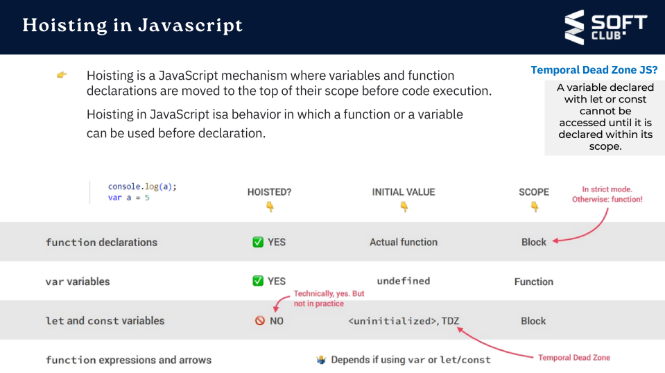
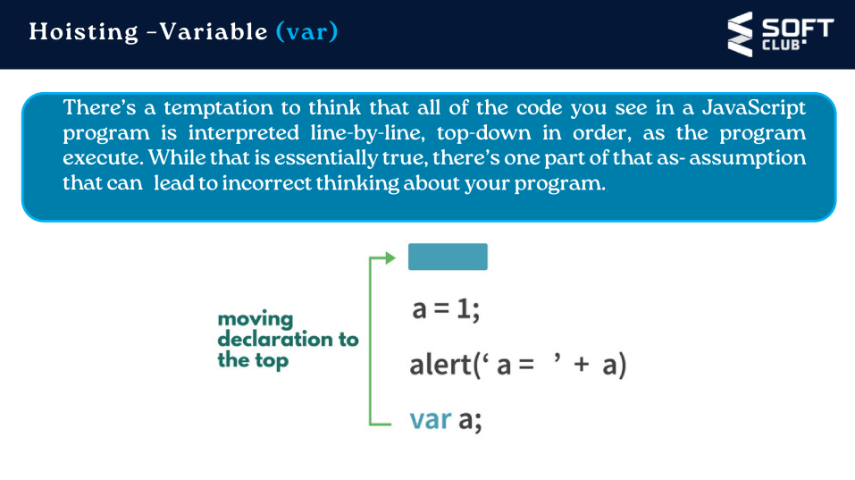
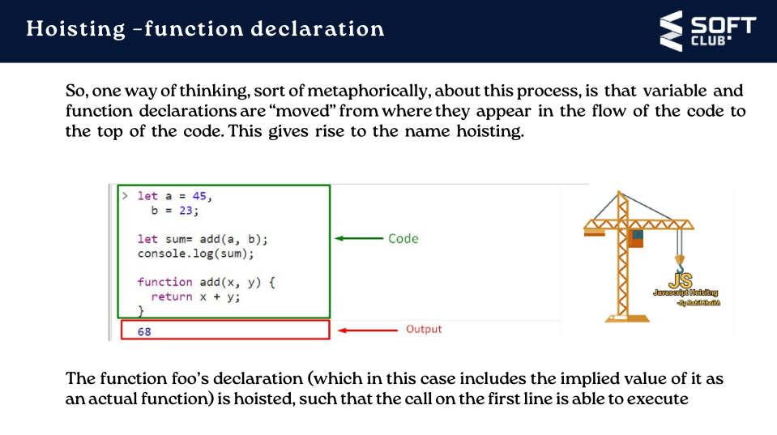
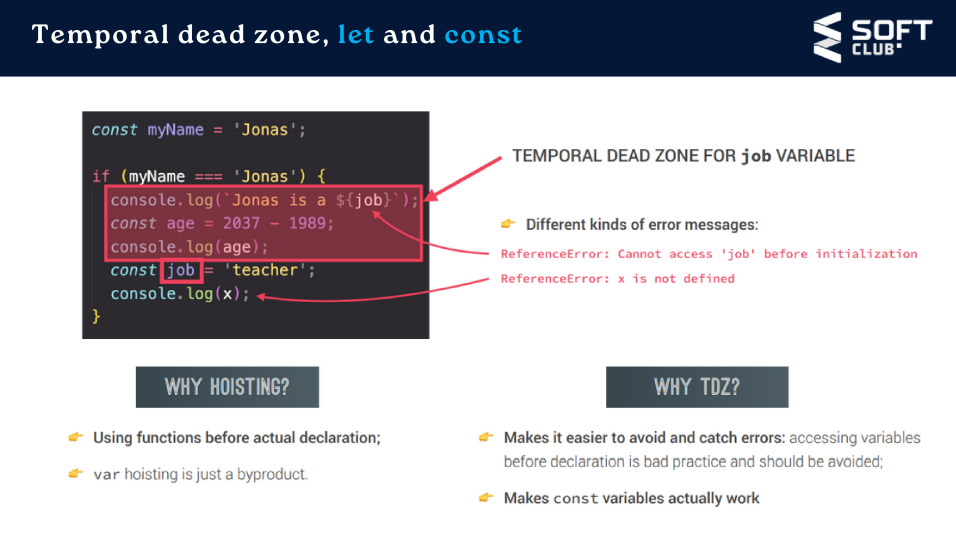

<h1 style = "text-align: center; margin: 50px;"> In this lecture we will talk about two JS topic </h1>
<h1 style = "font-size: 50px; color: lightgreen; font-family: inheri; border: none"> 1. Scope </h1>
<h1 style = "text-align: center; font-family: sans; border: none;"> and </h1>
<h1 style = "font-size: 50px; color: ; text-align: end; color: skyblue; font-family: inheri;"> 2. Hoisting </h1>
<h1 style = " margin-left: 150px; margin-top: 50px; font-size: 50px; border: none; "> What is  Scope  </h1>
<h1 style = " margin-left: 350px; font-size: 50px; border: none;"> in  JavaScript  ? </h1>
<h1 style = "width: 250px; margin: auto; border: none;"> _____________________ </h1>
        <h2> JavaScript has the following kinds of scopes </h2>

    

        <ul>
            <li >  Global scope  : The dafault scope for all code running in script mode. </li>
            <li>  Function scope  : The scope created with a function </li>
            <li>  Block scope  : This scope restricts the variable that is declared inside a specific block, from acces by the outside of the block. </li>
            <li>  Module scope  : The scope for code runnign in module mode. </li>
        </ul>
    

    

 The 3 types of scopes 

<h1 style = " margin-left: 150px; margin-top: 50px; font-size: 50px; border: none; "> What is  Hoisting  </h1>
<h1 style = " margin-left: 350px; font-size: 50px; border: none;"> in  JavaScript  ? </h1>
<h1 style = "width: 250px; margin: auto; border: none;"> _____________________ </h1>

<h1 style="font-size: 100px; font-family: monospace; color: rgb(13, 73, 13); text-align: center"> Thank    you!  </h1>